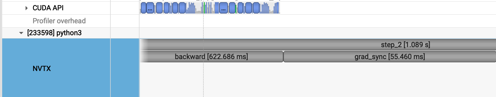
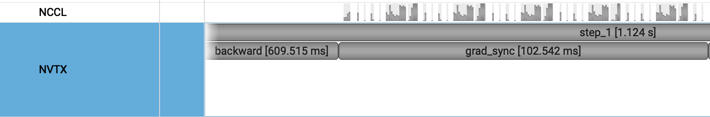

# (distributed_communication_single_node): Distributed Communication (Single Node)
size(MB)\GPUs |          2 |          4 |          6
----------------------------------------------------
           1 |      0.029 |      0.028 |      0.027
          10 |      0.056 |      0.077 |      0.118
         100 |      0.401 |      0.498 |      0.493
        1000 |      3.291 |      4.505 |      4.128


# Problem (naive_ddp_benchmarking): Naïve DDP Benchmarking 
step_max=1115.265 ms, comm_max=63.748 ms, comm_ratio=0.057

# Problem (minimal_ddp_flat_benchmarking): Minimal DDP with Flat Gradients Benchmarking
step_max=1119.685 ms, comm_max=50.251 ms, comm_ratio=0.045

# Problem (ddp_overlap_individual_parameters_benchmarking): DDP Overlapping Individual Parameters Benchmarking 
## (a)
[per_param] step_max=1116.618 ms, comm_max=66.320 ms, comm_ratio=0.059
[     flat] step_max=1119.656 ms, comm_max=51.292 ms, comm_ratio=0.046
[  overlap] step_max=1078.494 ms, comm=N/A (overlapped)
## (b)
overplap DDP:
```bash
DDP_MODE=overlap NSYS=1 nsys profile \
  --trace=cuda,nvtx \
  --capture-range=cudaProfilerApi --capture-range-end=stop \
  --force-overwrite=true \
  -o scripts/nsys_out/ddp_overlap \
  uv run python cs336_systems/benchmark_ddp.py
```


Sync DDP:
```bash
DDP_MODE=per_param NSYS=1 nsys profile \
  --trace=cuda,nvtx \
  --capture-range=cudaProfilerApi --capture-range-end=stop \
  --force-overwrite=true \
  -o scripts/nsys_out/ddp_sync \
  uv run python cs336_systems/benchmark_ddp.py
```

