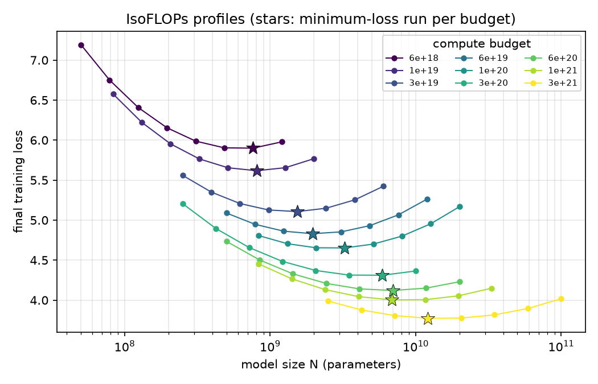
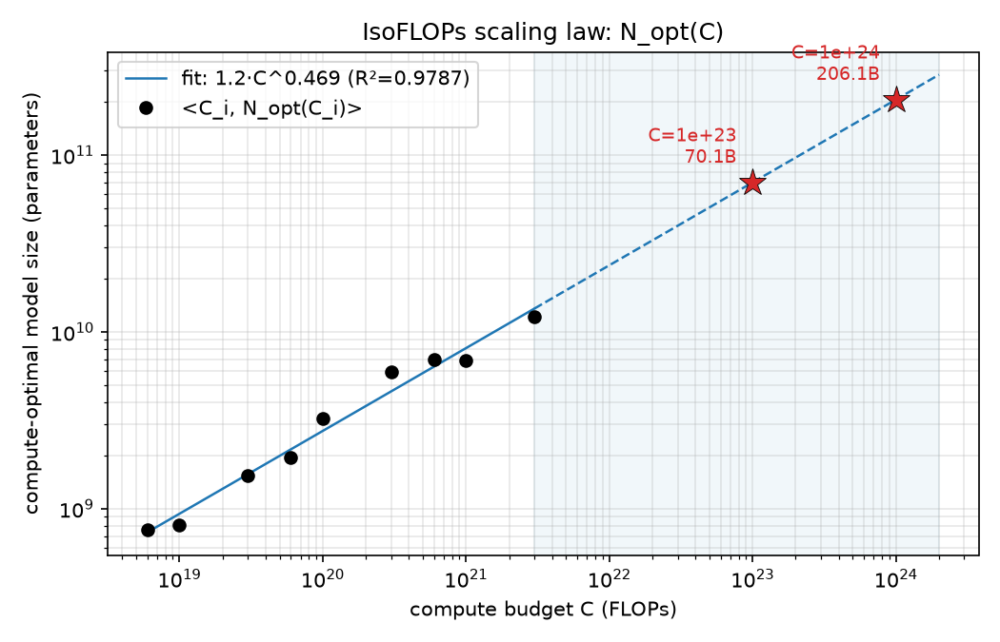
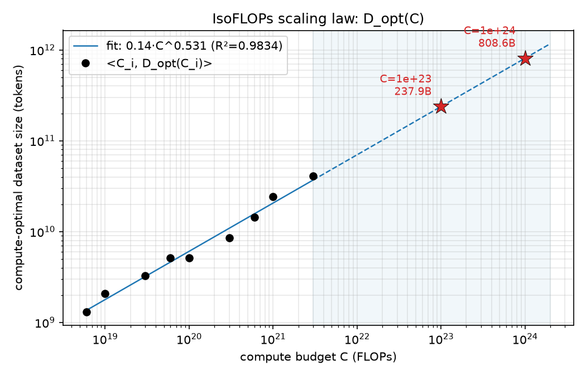

# Problem (chinchilla_isoflops): IsoFLOPs scaling laws (5 points)

代码：`scripts/isoflops.py`（本地即可运行：分组取最优 → log-log 最小二乘拟合幂律 → 外推画图；handout 允许任意拟合方法，用 `np.polyfit` 免去 scipy 依赖）。`data/isoflops_curves.json` 是**输入数据**（72 个 run 的 `{parameters, compute_budget, final_loss}`，9 个计算预算 × 8 个模型规模）。

## 方法

1. **分组**：按 `compute_budget` 把 72 个 run 分成 9 个 IsoFLOPs profile；
2. **取最优点**：每个预算内取 `final_loss` 最小的 run 作为 $N_{\mathrm{opt}}(C_i)$（按 handout 建议直接取最小，不做二次曲线拟合）；数据集规模由 Chinchilla 近似 $C \approx 6ND$ 反推：$D_{\mathrm{opt}}(C_i) = C_i / (6N_{\mathrm{opt}}(C_i))$；
3. **拟合幂律**：对 $\log_{10}N_{\mathrm{opt}} = b + a\log_{10}C$ 做最小二乘（`np.polyfit` 阶数 1），$D$ 同理独立拟合；
4. **外推**到 $10^{23}$、$10^{24}$ FLOPs。

## 拟合用的数据点 ⟨C_i, N_opt, D_opt⟩

| C_i | N_opt | D_opt |
|---|---|---|
| 6e18 | 762M | 1.3B |
| 1e19 | 807M | 2.1B |
| 3e19 | 1.5B | 3.3B |
| 6e19 | 2.0B | 5.1B |
| 1e20 | 3.3B | 5.1B |
| 3e20 | 5.9B | 8.5B |
| 6e20 | 7.0B | 14.3B |
| 1e21 | 6.9B | 24.3B |
| 3e21 | 12.1B | 41.2B |

IsoFLOPs profiles（每个预算的 loss–N 曲线，星标为选中的最优点）：

## 拟合结果

$$N_{\mathrm{opt}} = 1.16 \cdot C^{0.4687} \quad (R^2 = 0.9787)$$

$$D_{\mathrm{opt}} = 0.143 \cdot C^{0.5313} \quad (R^2 = 0.9834)$$

两个指数之和 = 1.0000（$D$ 由 $C/(6N)$ 反推，$b_D = 1 - b_N$ 恒成立，交叉验证了实现一致性）。指数 0.47/0.53 与 Chinchilla 论文的 $N_{\mathrm{opt}} \propto C^{0.50}$、$D_{\mathrm{opt}} \propto C^{0.50}$ 接近；数据中 6e20→1e21 的 $N_{\mathrm{opt}}$ 轻微回落（7.0B→6.9B）是"8 个 run 取最小"的采样噪声，幂律拟合已将其平滑。

## (a) 计算最优模型规模

**答案**：拟合得 $N_{\mathrm{opt}} \approx 1.16\,C^{0.469}$，外推到 $10^{23}$ FLOPs 的计算最优模型规模约 **7.0×10¹⁰（~70B 参数）**，到 $10^{24}$ FLOPs 约 **2.1×10¹¹（~206B 参数）**。

## (b) 计算最优数据集规模

**答案**：拟合得 $D_{\mathrm{opt}} \approx 0.143\,C^{0.531}$，外推到 $10^{23}$ FLOPs 的计算最优数据集规模约 **2.4×10¹¹ token（238B tokens）**，到 $10^{24}$ FLOPs 约 **8.1×10¹¹ token（809B tokens）**。
