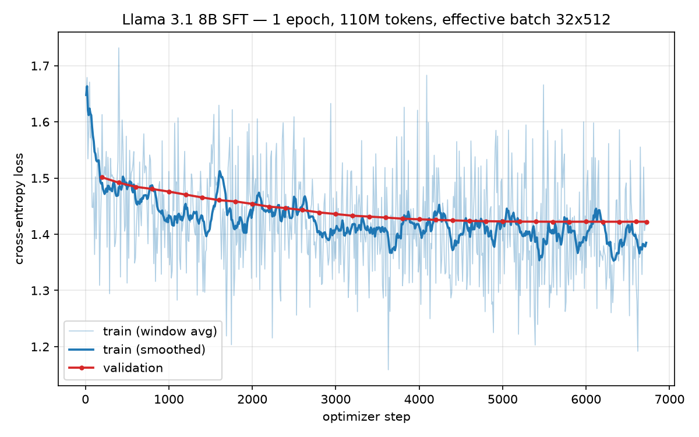

# 4 Instruction Fine-Tuning

## Problem (look_at_sft): Inspect instruction tuning data (4 points)

数据：`data/sft/train.jsonl`（UltraChat-200K + SafetyTunedLlamas 混合，已处理成单轮 prompt/response，来自 HF 镜像 `garg-aayush/sft-cs336-assign5-datasets`，官方源在 Modal 卷不可达）。

随机抽样命令：

```bash
python3 -c "
import json, random
docs = [json.loads(l) for l in open('data/sft/train.jsonl')]
random.seed(0)
for d in random.sample(docs, 10):
    print('=' * 80)
    print('PROMPT:', d['prompt'][:300])
    print('RESPONSE:', d['response'][:300])
"
```

抽样 10 条（seed=42）的构成：创意写作 3（按 prompt 指定的 POV/情节约束生成爱情、惊悚与环境灾难叙事）、代码生成 2（带注释与输入校验的 C++/JS 函数）、知识解释 2（DNS 原理、ML 训练显存优化，回复结构化分点）、`Answer/Generate according to:` 式阅读理解 2、释义改写 1——隐式任务覆盖 QA、创作、代码、改写/摘要，且几乎每条 prompt 都带明确格式或约束要求（"third person omniscient"、"case sensitive"、"not modify the original list"），response 中位 1,309 字符且忠实执行这些约束，整体质量较高。主要瑕疵是 according-to 类样本存在"答案埋在 prompt 里"的捷径（如某条 prompt 直接给出 "The total population changed 7.2%"，response 只是把该数字抄一遍），模型从中学到的是抽取复述而非推理；此外未见空回复或格式损坏（数据已单轮化处理）。

## Problem (data_loading): Packed SFT dataset + batching (3 points)

代码：`cs336_alignment/sft.py`（`PackedSFTDataset` + `iterate_batches`），`tests/adapters.py` 已接线。

规格（已用 `tests/fixtures/tokenized_sft_sample.json` 快照逐 token 反向验证）：

- 每条文档用 `prompts_safety/alpaca_sft.prompt` 模板渲染（`instruction`←`prompt` 字段），**渲染后 `strip()`**——模板末尾 `\n` 会多出一个 token，从快照 chunk 28 开始错位。
- `tokenizer(text)` 走默认 `add_special_tokens=True`（Llama 自动加 BOS，**不要手动再加**），每文档末尾手动追加 `tokenizer.eos_token_id` 作分隔符。
- 全部 token 拼成一条流 `T`，`input_ids = T[:-1]`、`labels = T[1:]` 各自 reshape 成 `(N, 512)`，块数 `(len(T)-1)//seq_length`——labels 跨 chunk 连续（chunk i 的最后一个 label = chunk i+1 的第一个 input token）。
- Dataset 的 `shuffle` 是文档级（拼接前打乱）；`iterate_batches` 的 `shuffle` 是 chunk 级（DataLoader sampler），一行 `DataLoader(dataset, batch_size, shuffle=shuffle)`，默认 `drop_last=False` 使 `len() == ceil(N/B)`。
- tokenize 批量进行（fast tokenizer `encode_batch` 并行，与逐条结果逐字节一致，已验证）。

测试：`uv run pytest -k "test_packed_sft_dataset or test_iterate_batches"` 通过（75 chunks 全部匹配）。

## Problem (sft_script): Training script (4 points)

代码：`scripts/sft_train.py`。单卡全参 SFT，不用 HF Trainer。

- **数据**：`PackedSFTDataset`（seq 512，文档级 shuffle），DataLoader chunk 级 shuffle、`drop_last=True` 保证 microbatch 均匀。
- **loss**：`logits = model(input_ids).logits` 后直接 `F.cross_entropy(logits.float(), labels)`——labels 已是 next-token（打包时移位过），**不能传 `model(labels=...)`**（会二次 shift）；`.float()` 上抛 fp32 算 128k vocab 的 softmax 更稳。
- **梯度累积**：`loss / accum_steps` 后 backward，每 8 个 microbatch clip(1.0) → step → scheduler.step → zero_grad；epoch 末 flush 不完整窗口。
- **调度**：AdamW(bf16, fused) lr 2e-5、wd 0.1，cosine decay 到 0 + 前 3% 步线性 warmup（本地 LambdaLR 实现，等价 `get_cosine_schedule_with_warmup`，避免 transformers 5.x API 变动）。
- **显存**（H20 98GB，8B bf16）：权重 16 + 梯度 16 + Adam m/v 32 = 64GB 基础占用，开 gradient checkpointing（`use_reentrant=False`），per-device batch 4 × accum 8 = 32 序列/步（handout 推荐），峰值 ~70GB。
- **日志**：每 10 步 console + `train_log.jsonl`（loss/lr/grad_norm/tok/s/ETA/峰值显存），每 200 步 val loss（默认 1024 条 packed 序列，token 加权平均）；结束写 `summary.json` 并保存 model + tokenizer（safetensors，bf16）。
- 超参全部可经 argparse 配置；`--max-train-docs`/`--max-steps` 用于快速冒烟。

## Problem (sft): Instruction tuning (6 points)

运行（GPU 机器，先下载数据集，见上）：

```bash
cd /mnt/cephfs/user_crzaxchen/336/assignment5-alignment
uv run python scripts/sft_train.py \
    --model /mnt/cephfs/user_crzaxchen/models/Meta-Llama-3.1-8B \
    --output-dir scripts/results/sft_llama31_8b \
    2>&1 | tee logs/sft_train.log
```

### 训练设置与结果

| 项目 | 值 |
|---|---|
| 模型 | Llama 3.1 8B base（bf16 全参微调，flash-attention 2 + gradient checkpointing） |
| 数据 | 210,348 docs（safety-augmented UltraChat 200k 单轮混合） |
| 打包 | 512 ctx → 215,248 条序列，1 epoch |
| 优化 | AdamW lr 2e-5（cosine + 3% warmup=201 步）、wd 0.1、clip 1.0 |
| batch | per-device 4 × accum 8 = 32 序列/步，共 **6,727 步 / 1.102 亿 token** |
| 硬件/时长 | 单卡 H20 98GB，**15.6 小时**（稳态 1,963 tok/s，MFU ≈ 48%，峰值显存 63.9GB） |
| **final val loss** | **1.4223**（val 曲线 1.501→1.422 单调下降，~5,200 步后收敛平台） |

train loss 窗口平均 1.648 → 1.416，波动来自 packed 序列内容难度差异（写作/代码/QA 混杂）属正常现象；val 曲线平滑无回升，1 epoch 无过拟合迹象。

学习曲线（`docs/figures/sft_curve.png`，由 `train_log.jsonl` 绘制）：



模型与 tokenizer（safetensors，bf16）保存在 `scripts/results/sft_llama31_8b/`，供 4.3 节评测与第 6 章 DPO 使用；训练摘要见同目录 `summary.json`，wandb run 名 `sft_llama31_8b`。
