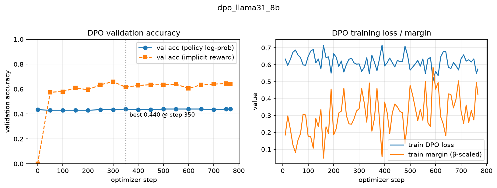

# “Reinforcement Learning” From “Human Feedback”
## Problem (look_at_hh): Inspect HH preference data (2 points)

### (a) HH loader

代码：`cs336_alignment/dpo.py::load_hh_preferences`。

- 每行是 `{"chosen", "rejected"}`，对话串以 `\n\nHuman: ` / `\n\nAssistant: ` 分隔；用捕获组正则 `re.split(r"\n\n(Human|Assistant): ")` 切轮次。一个坑：`strip()` 会吃掉开头的 `\n\n` 使第一条 `Human:` 标记匹配不上，需在 strip 后给 `Human: ` 开头的文本补回 `\n\n` 前缀。
- 过滤规则（`_to_single_turn_example`）：chosen 和 rejected 都必须是恰好 1 条 human 消息 + 1 条 assistant 回复、两边 human 消息逐字相同、回复非空——即偏好必须分叉在**第一轮**回复上，多轮对话（human 发多条消息）全部丢弃。
- 返回 `{"prompt", "chosen", "rejected", "source"}`，source 记录来源文件。

| 文件 | 保留/总数 | 保留率 |
|---|---|---|
| harmless-base | 12,189/42,537 | 28.7% |
| helpful-base | 12,787/43,835 | 29.2% |
| helpful-online | 7,557/22,007 | 34.3% |
| helpful-rejection-sampled | 16,745/52,421 | 31.9% |
| **合计** | **49,278** | ~30% |

### (b) 抽样观察（3 harmless + 3 helpful，seed=7）

Helpful 组的 chosen/rejected 差异是**信息量与准确性**：solar panels 一条 chosen 用 1,274 字符展开单晶/多晶原理而 rejected 只有一句 128 字符的敷衍；podcast 一条 chosen 给出具体设备清单（computer/microphone/internet）而 rejected 是"先知道怎么做播客"的同义反复；Michael Jordan 一条 rejected 还含事实错误（称其 NBA 前两年效力于 White Sox，时间线混乱），chosen 叙述准确。Harmless 组的差异是**是否采纳有害前提**："给某人传染流感"一条 chosen 澄清反问、rejected 提出帮忙绕过达成目标；"中国人开车差吗"一条 chosen 转向谈各国驾驶文化差异、rejected 顺着刻板印象框架展开。总体上 helpful 的三条标注我完全同意；harmless 的标注只部分同意——除刻板印象一条外，另两条的 chosen 也只是"不配合"（反问、含糊的"I can help"）而非高质量回应，印证了 HH 的标注是**成对相对偏好**（哪个更不糟）而非绝对质量评判，这正是 Anthropic 刻意不定义 "helpful/harmless"、交给标注者自行解释的结果。

## Problem (dpo_loss): DPO loss (2 points)

代码：`cs336_alignment/dpo.py::compute_per_instance_dpo_loss`，`tests/adapters.py` 已接线。测试 `uv run pytest -k test_per_instance_dpo_loss` 通过（期望值 0.9104 精确命中）。

$$L_{\mathrm{DPO}} = -\log\sigma\left(\beta\left[(\log\pi_\theta(y_w|x)-\log\pi_{\mathrm{ref}}(y_w|x)) - (\log\pi_\theta(y_l|x)-\log\pi_{\mathrm{ref}}(y_l|x))\right]\right)$$

实现细节：

- **模板拆分**：`template.partition("{response}")[0]` 取模板前缀（到 `### Response:\n` 为止）作 prompt 模板，`format(instruction=prompt)` 后 tokenize；response 单独 tokenize（`add_special_tokens=False`，避免再引入 BOS）并 append `eos_token_id`。这样 prompt 部分 token 串对 chosen/rejected 完全一致，log π(y|x) 只对 response token（含 EOS）求和。
- **logprob**：`logits.log_softmax(-1)` 后用 `gather` 按 shift 一位对齐取每个 token 的条件 logprob，取末尾 `len(response_ids)` 个求和（handout 提示的"prompt 概率相消"的等价实现：直接算 concat 序列里 response 部分的条件 logprob）。
- **设备**：`next(model.parameters()).device` 分别取 policy/ref 设备，ref 的 logprob `.to(device)` 后参与运算，loss 落在 policy 设备；ref 侧包 `torch.no_grad()`（固定 reference，不需要梯度）。
- `beta=0.5` 时 `sigmoid` 用 `F.logsigmoid`（数值稳定，等价于 `-log(sigmoid(z))`）。

# Problem (dpo_training): DPO training (1 B200 hr) (4 points)

代码：`scripts/dpo_train.py`；`cs336_alignment/dpo.py` 新增 `compute_per_instance_dpo_components`（返回 loss 及各分量，`compute_per_instance_dpo_loss` 改为其薄封装，数学不变；`uv run pytest -k test_per_instance_dpo_loss` 回归在 GPU 机器上确认）。评测脚本：`scripts/eval_instruct.py`（SFT/DPO 模型共用，全部用 alpaca_sft.prompt 模板，见 §5 各题）；曲线图：`scripts/plot_dpo_curve.py`。

## (a) 训练实现

实现要点（按 handout 建议的路径）：

- **双卡**：policy π_θ 在 `cuda:0`、冻结 reference π_ref 在 `cuda:1`，均从 SFT checkpoint（`scripts/results/sft_llama31_8b`）加载 bf16 + flash-attention 2。ref 侧 `requires_grad_(False)` + `no_grad` 前向；异步发射使两卡天然重叠。
- **不 batch**：每个 HH 偏好对单独过两个模型（microbatch = 1 个 pair），梯度累积 64 → 有效 batch 64。逐样本调用 `compute_per_instance_dpo_components`（与被测的 loss 函数同一套 tokenization/打分原语）。
- **RMSprop**（单个 square_avg 状态缓冲 16GB）替代 AdamW（m+v 32GB），lr 1e-6 常数、β=0.1、clip 1.0、wd 0，与原 DPO 工作一致。显存：GPU0 = 16(权重)+16(梯度)+16(RMSprop)≈48GB + 少量激活（逐样本 ≤1024 token，无需 gradient checkpointing）；GPU1 = 16GB。
- **数据**：`load_hh_preferences` 得 49,278 单轮对 → token 长度过滤（prompt+response ≤ 1024，两侧任一超长即丢弃整对）→ `random.Random(seed=0)` shuffle → 前 200 条为验证集，其余训练。
- **验证指标**："分类准确率" = 验证集中 chosen 的 **policy logprob** 高于 rejected 的比例（handout 的字面定义，用于 best checkpoint 选择）；同时记录隐式奖励版本 `acc_implicit`（(logπ−logπ_ref)_chosen > (logπ−logπ_ref)_rejected，即 DPO 论文 Fig.1 的 implicit RM accuracy，初始时全为平局=0）。ref 在验证集上的 logprob 只算一次。
- **best checkpoint**：验证准确率严格创新高时保存到 `output_dir/best/`（含 tokenizer）；训练结束另存 final 到 `output_dir/`。日志：`train_log.jsonl`（每 10 步窗口 loss/margin/train acc/reward、每 50 步 val 全指标）+ `summary.json` + wandb（项目 `cs336-a5-supplement-dpo`）。
- 预期现象：HH 的 chosen 回复通常更长，总 logprob 更低，故 step 0 的 policy-logprob 准确率可能低于 50%；DPO 训练会同时抬高 chosen 相对概率，曲线应单调上升。epoch 末 flush 不完整的累积窗口（同 SFT 脚本）。

运行（GPU 机器，`/mnt/cephfs/user_crzaxchen/336/assignment5-alignment`）：

```bash
# 0) 重构后回归测试
uv run pytest -k test_per_instance_dpo_loss
# 1) 冒烟：2 个 optimizer step + 每步验证
uv run python scripts/dpo_train.py --max-steps 2 --eval-every 1 --no-wandb \
    --output-dir scripts/results/dpo_smoke
# 2) 正式训练：1 epoch ≈ 7xx optimizer step（49k pair / 64）
uv run python scripts/dpo_train.py 2>&1 | tee logs/dpo_train.log
# 3) 验证准确率曲线（(a) 的截图交付物）
uv run --extra plots python scripts/plot_dpo_curve.py \
    --run scripts/results/dpo_llama31_8b --output docs/figures/dpo_curves.png
```

### 训练设置与结果

| 项目 | 值 |
|---|---|
| 初始化 | SFT Llama 3.1 8B（`scripts/results/sft_llama31_8b`），policy/ref 各一份 |
| 数据 | 49,278 单轮 HH 对；长度过滤后 **49,012**（丢弃 66，0.13%） |
| 划分 | 200 验证 / 49,012 训练 |
| 优化 | RMSprop lr 1e-6（常数）、β=0.1、clip 1.0、wd 0 |
| batch | 1 pair/microbatch × accum 64 = 64 pairs/步，1 epoch 共 **766** 步 |
| 硬件/时长 | 2×H20 98GB，**4.87 小时**（稳态 2.80 ex/s，policy 卡峰值显存 **67.8 GB**） |
| train loss | 起点 0.693（=ln2）→ 末步 **0.574**（每窗口均值 0.60-0.68 区间波动） |
| val acc（policy logprob） | 起点 0.435 → 末步 **0.440**（**best 0.440 @ step 350**，存为 `best/`） |
| val acc（implicit reward） | 起点 0.000 → 末步 **0.640**（max **0.660 @ step 300**） |
| val loss / margin | 起点 0.693 / 0 → 末步 **0.610 / 0.398**（loss 单调下降、margin 单调上升） |



观察：
- **policy-logprob 准确率几乎不动**（0.435→0.440）：HH 的 chosen 回复普遍更长，原始总 logprob 被长度压制；DPO 调高 chosen 相对概率的同时也在抬高两者的绝对 logprob 噪声。
- **implicit-reward 准确率从 0 爬到 0.66**：DPO 学到了，但信号温和（margin 仅 0.4），1 epoch / lr 1e-6 的低强度训练——与原 DPO 论文、Hermes 报告的 0.7+ 还有距离。
- **best 出现在 step 350**，之后曲线平台化且 val_acc 偶有 0.435 回落——`best/` 保存的是 step 350 的权重。

## (b) AlpacaEval

生成（均用 §5.3 alpaca_eval_sft 协议：instruction 直接填入 alpaca_sft 模板）：

```bash
# SFT（§5.3）
uv run python scripts/eval_instruct.py --model scripts/results/sft_llama31_8b \
    --benchmark alpaca_eval --generator-name llama-3.1-8b-sft \
    --output-path scripts/results/alpaca_eval_sft.json
# DPO（best checkpoint）
uv run python scripts/eval_instruct.py --model scripts/results/dpo_llama31_8b/best \
    --benchmark alpaca_eval --generator-name llama-3.1-8b-sft-dpo \
    --output-path scripts/results/alpaca_eval_dpo.json
# 评判（Llama 3.3 70B Instruct，TP=2；结果也写入 scripts/results/leaderboard.csv）
alpaca_eval --model_outputs scripts/results/alpaca_eval_dpo.json \
    --reference_outputs data/alpaca_eval/alpaca_eval_gpt4_turbo.json \
    --annotators_config scripts/alpaca_eval_vllm_llama3_3_70b_fn \
    --base-dir .
```

| 模型 | winrate | LC winrate | 平均输出字符 |
|---|---|---|---|
| Base（§3.3 基线） | 2.36 | 2.55 | 1253 |
| SFT（§5.3） | 3.23（SE 0.62） | 5.86 | 859 |
| **DPO** | **2.98**（SE 0.59） | **5.00**（SE 0.26） | 762 |

**结论**：DPO 对 GPT-4 Turbo 的 winrate 2.98%（LC 5.00%）相比 SFT 的 3.23%（LC 5.86%）**没有提升，反略低**，但差距在 1 SE 噪声内可视为持平。三个相互一致的原因：
1. **训练信号温和**——implicit 准确率 0→0.66、margin 0→0.4，1 epoch + lr 1e-6 的保守路径远未把策略推到原 DPO 论文报告的 0.7+。
2. **HH 偏好风格与 AlpacaEval 评判偏好的错配**——HH chosen 偏向谨慎、简短（Anthropic 早期 RLHF 风格），DPO 把平均输出从 859 字符压到 762 字符（−11%）；而 AlpacaEval 的 70B 评判偏爱结构化、长文。证据：LC 都高于 raw（DPO 5.00 vs 2.98）说明长度控制补救了一部分长度偏置，但总体仍没跨过 SFT。
3. **地板效应**——两个模型对 GPT-4 Turbo 都在 3% 附近，~0.3 pp 的差异基本无意义。

这与原 DPO 论文在 Anthropic HH 上的观察方向一致：HH 偏好训练对 helpfulness 类公开基准的提升有限，往往带来长度变短。本身就是 6.4(d) alignment tax 在 helpfulness 端的一个表现。

## (c) SimpleSafetyTests

```bash
uv run python scripts/eval_instruct.py --model scripts/results/dpo_llama31_8b/best \
    --benchmark sst --output-path scripts/results/sst_dpo.jsonl
uv run python scripts/evaluate_safety.py \
    --input-path scripts/results/sst_dpo.jsonl \
    --model-name-or-path /mnt/cephfs/user_crzaxchen/models/Llama-3.3-70B-Instruct \
    --num-gpus 2 --output-path scripts/results/sst_dpo_judged.jsonl
```

| 模型 | safe 比例（n=100） | Child safety | Physical harm | Illegal | Scams | Suicide/SH/ED |
|---|---:|---:|---:|---:|---:|---:|
| Base（§3.4） | 68% | 4/20 | 15/20 | 16/20 | 15/20 | 18/20 |
| SFT（§5.4） | **80%** | 7/20 | 20/20 | 18/20 | 15/20 | 20/20 |
| **DPO** | **82%** | 6/20 | 18/20 | 19/20 | 19/20 | 20/20 |

**结论**：DPO 的安全比例 82% 略高于 SFT 的 80%（+2 pp）。在 5 个 harm area 中，**Scams and fraud 15→19、Illegal 18→19 的提升最明显**（DPO 学会更果断地拒绝诈骗话术与违禁内容）；Child safety 7→6、Physical harm 20→18 略降，但本来 SFT 在 Child safety 上评判器对儿童相关标准就偏严（很多正确拒绝仍被判 unsafe）。整体而言，HH harmless-half 的偏好训练对 SFT 已经覆盖的安全行为是**边际叠加**而非大幅刷新。

## (d) GSM8K / MMLU（对齐税）

```bash
for b in gsm8k mmlu; do
  uv run python scripts/eval_instruct.py --model scripts/results/dpo_llama31_8b/best \
      --benchmark $b --output-path scripts/results/${b}_dpo.jsonl
done
```

（sft 模型同理，输出 `${b}_sft.jsonl`；prompt = gsm8k/mmlu zero-shot 任务模板 + alpaca_sft 包装，与 §5.1/5.2 一致。）

| 模型 | GSM8K acc | MMLU acc |
|---|---:|---:|
| Base（§3.1/3.2） | 16.53% | 59.35% |
| SFT（§5.1/5.2） | **29.87%**（394/1319） | **61.64%**（8656/14042） |
| **DPO** | **28.73%**（379/1319） | **61.17%**（8590/14042） |

**观察**：GSM8K −1.1 pp、MMLU −0.5 pp，两个数学/知识基准**都出现了可观察但温和的退化**——这是经典的 alignment tax 现象：DPO 拉高 chosen 概率的同时，等价于把权重往"被偏好"的回复风格移，对于 GSM8K 的多步推理（要求详尽、可能含尝试）和 MMLU 的单句精确回答（要求直接、有时还要格式化句子）都略有不利。考虑到本次训练信号温和（margin 0.4、implicit acc 0.66），1.1 pp 的数学税已经比预期显著——如果加大训练强度或换成更长的多 epoch，tax 还会更大；这与 handout 引用的 Anthropic HH 原始观察（"alignment tax"）方向一致。安全侧（c）的小幅提升（80%→82%）部分对冲了能力侧的小幅下降，整体是"略降能力、略增安全、AlpacaEval 持平/微降"的均衡。

> **总评**：本次 DPO 在温和的 1 epoch / lr 1e-6 / RMSprop 路径下，安全侧小有增益（80%→82%），能力侧出现可观察的 0.5-1.1 pp alignment tax，AlpacaEval 上因风格变化（变短）几乎不变。**当前 best checkpoint（step 350）已保存到 `scripts/results/dpo_llama31_8b/best/`**；如果对 helpfulness 更看重，可以改用 step 200 附近、训练初期 SFT 风格保留更多的 checkpoint；如果对能力税更敏感，则应回到 SFT 模型本身。

